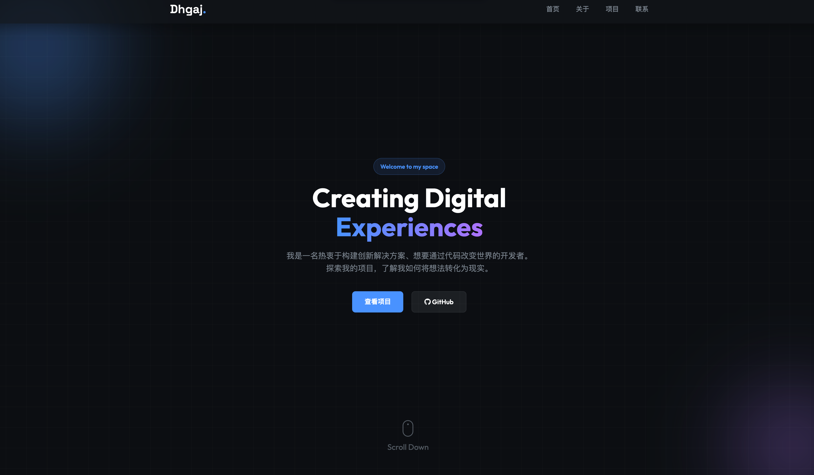

# Dhgaj.github.io

> 🚀 **正在开发中 (Work In Progress)**
>
> 本项目目前处于积极开发阶段，部分页面可能会发生较大改动。

## 简介 (Introduction)

这是 Dhgaj 的个人展示主页（Portfolio），用于展示个人项目、技术栈以及联系方式。

- **动态展示**: 自动集成 GitHub API 获取最新项目。
- **现代设计**: 采用深色模式、玻璃拟态 (Glassmorphism) 和流畅的交互动画。
- **响应式**: 完美适配桌面端和移动端设备。

## 预览 (Preview)

> 🔗 **在线访问 (Live Demo):** [https://Dhgaj.github.io](https://Dhgaj.github.io)

## 技术栈 (Tech Stack)

- HTML5 (Semantic)
- CSS3 (Variables, Flexbox, Grid, Animations)
- JavaScript (ES6+, Fetch API)
- Font Awesome (Icons)
- Google Fonts (Outfit, Space Grotesk)

## 证书 (License)

[MIT](LICENSE) © 2026 Dhgaj
